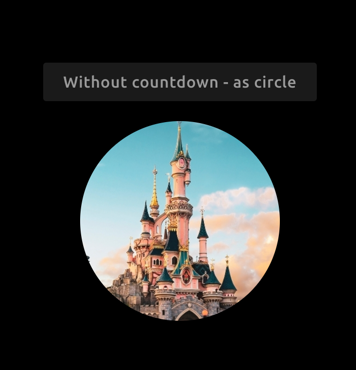

# Image Viewer

The Image Viewer widget shows an image from a URL (or local path). You can also show a countdown in days from a given date.

## Screenshot

  
  

## Functionality

The Image Viewer widget has the following functionality.

- Show an image
- Show a countdown in days
- Show image as a circle
- Adjust the size of an image

## How to use

Simple add the Image Viewer widget on your Smart Mirror using the Senses - Smart Mirror app. This widget doesn't require any other configuration.

## Configuration

| Setting | Description |
| ----------- | ----------- |
| Widget Title | Widget header title, by default the header title for the widget is empty |
| Url | The url of the image (or local path) | 
| Max width | Max width of the image including px or %. Default 100% |
| Show countdown | Show a countdown in days |
| Date | The date used for the countdown. Format dd-MM-yyyy |
| Show image as circle | Show the image as a circle |
| Circle size | Circle width and height (incl. px). Example: 100px |

All other configuration settings are explained [here](/widgets/introduction.html#default-widget-configuration-options).
